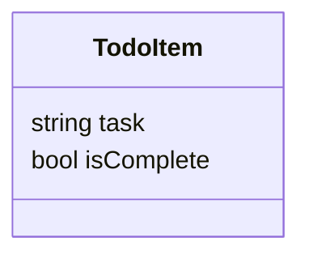
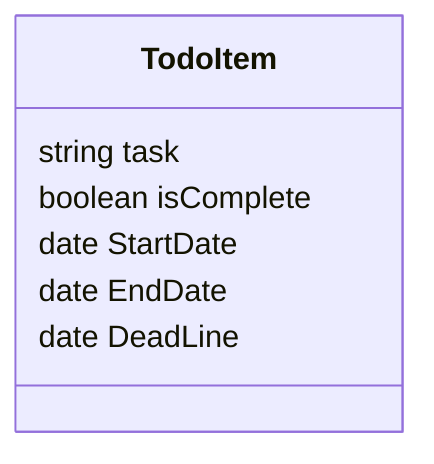

# Todo Application (again)

## Clean Overview

Please Doc, Please have the discipline to do this. I need you to focus on this work and nothing else. It seems as you get older you start to lose more and more focus. Gain your focus back. Take deep breaths and exercise for goodness sake, anyway enough rambling, try to do something.

Okay Doc, here you go again at creating a Todo application. You know what you want it to look like in your head, but now is the time to put it down on paper.

To do this (No pun intend) I want you to take Derek approach to this and do a data first design. What is a todo item? What does it contain? What are the properties of a “Todo”.

Let’s think about this for a second at the core a todo item is an item containing two components, a task (string) and whether or not the task is completed.

Let’s write this done as a UML diagram for this.



Now the Todo item at the core is kind of plain, and bland. Let’s add some pizazz to this. I am a procrastinator, and if I don’t have a deadline to do something then it will always get pushed back, so for motivation let’s add a start date an end date and a deadline, that way we can have our anxiety help motivate us, yeah!



Okay that is s a little more ugly, but screw it! I don’t care I just want to do this! (Pun intended).

Awesome we now have a starting point with the structure of the data, but the question is now, how do we get this data? How do we start using this?

The answer is API first, yes I said it we are doing an API first approach to this.

This API will start of with one CRUD endpoint which will be
/todos.

Okay we have enough to get started, so what do we do first.

## Checklist

1.) Create a database Schema for the todo Item

2.) Create a API for the todo application

## Flask notes

## Sqlalchemy notes

[SQLAlchemy](https://docs.sqlalchemy.org/en/14/tutorial/index.html) uses two different api, one built ontop of another. The two APIS are **CORE** and **ORM**.

### SQLAlchemy Core

This is the base architecture for SQLAlchemy. This library connects to the database and performs the queries.

### SQLAclhemy ORM

This builds open the core library providing object relational mapping. This allow user to create python classes to be mappped to the database. Also allowing to create sessions.

### Establishing Connectivity - the Engine

The start of an SQLAlchmey application starts with the **Engine**. The engine starts the connection pool for connecting to the database.

The Engine is a global object and it's configure by a URL.

Example Setup SQLAlchemy engine

```python
# Import sqlalchmey
from sqlalchmey import create_engine
# Sqlite -> Database
# pysqlite -> DBAPI
engine = create_engine("sqlite+pysqlite:///:memory:", echo=True)
```

### Working with Transactions and the DBAPI

The **engine** creates two different endpoints **Connection** and **Result**. The **text()** package allows us to write SQL statements as text.

Thie purpose of **engine** is to start a **connection** to the database, after
the connection is establised to the database, executing a query using text will get the **results**.

#### Connection

```python
# text is used to write SQL statements using the connection from the engine.
from sqlalchemy import text
with engine.connect() as conn:
    result = conn.execute(text("select 'hello world'"))
    print(result.all())
```

The transaction doesn't automatically commit, what happens if the sql statement is not commited, when the connection closes the transaction is rolled back. To commit the transaction we need to call the **commit** method on the connection.

```python
from sqlachemy import text
with engine.connect() as conn:
    conn.execute(text("CREATE TABLE point (x int, y int)"))
    conn.execute(text("INSERT INTO point (x,y) VALUES (:x, :y)"), [{"x": 1, "y": 1}, {"x":2, "y": 4}])
    conn.commit()
```

This style is commit as you go there is another sytle of commit which is began once.

```python
with engine.begin() as conn:
    conn.execute(
        text("INSERT INTO point (x,y) VALUES (:x, :y)"),
        [{"x": 6, "y": 8}, {"x", "y": 10}]
    )
```

What happens here is that after the connection statement exits out it will automatically commit if the block executes successfully.

#### Results

When executing a transaction to the database after you connect will return **results**. The results object will contain the list of rows as tuple.

```python
with engine.connect() as conn:
    result = conn.execute(text("SELECT x, y FROM point"))
    for row in result:
        print(f'x: {row.x}, y: {row.y}')
```

#### Executing with an ORM Session

ORM uses Session for there transactions. A session will take an engine as a paramenter to make the connection

```python
from sqlalchemy.orm import Session
stmt = text("SELECT x, y FROM point WHERE y > :y ORDER BY x, y")
with Session(engine) as session:
    result = session.execute(stmt)
    for row in result:
        print(f"x: {row.x} y: {row.y}")
```

Just like connection statement session needs to commit before closing the session, or ending the session block.

```python
stmt = text("INSERT INTO point (x,y) VALUES (:x, :y)")
with Session(engine) as session:
    session.execute(stmt, [{"x":10, "y":20}, {"x": 12, "y":24}])
    session.commit()
```

### Working with database Metadata

Database Metadata is basically Python object that represent database concepts like tables and columns.

Common object used for database metadata are **Metadata**, **Table**, and **Column**.

### Setting up Metadata wit Table object

Table object can be **declared** which means that it's explicitly spelled out in the source code, or **reflected** which means the object is generated based on the table in the database.

```python
from sqlalchemy import MetaData
metadata = MetaData()
```

Adding a **MetaData** object will allow us to create **Table** objects.

```python
from sqlalchemy import Table, Column, Integer, String
user_table = Table(
    'user_account', 
    metadata, 
    Column('id', Integer, primary_key=True),
    Column('name', String(30))
)
```

Constraints are condtions that are set inside a certain colulmn, for example the example above *id* has is used as the primalry_key meaning that each Id needs to be unique.

The most common constraint is the **ForeignKeyConstraint** which is used as a ForeignKey in the next Database.

```python
form sqlalchemy import ForeignKey
address_table = Table(
    "address",
    metadata,
    Column("id", Integer, primary_key=True),
    Column("user_id", Ineter, ForeignKey('user_account.id'), nullable=False),
    Column('email_address', String, nullable=False)
)
```

Another constraint will be the **Column.nullable**

To create the table we need create it from the metadata by calling the engine.

```python
metadata.create_all(engine)
```

Using the ORM will create a Python Object mapping that maps classes to DB tables. To do this we need to create a **registry()**

```python
from sqlalchemy.orm import registry
mapper_registry = registry()
```

This automatically creates a metadata object usage below.

```python
mapper_registry.metadata
```

Instead of create a table using a Table object, we can a table by using a declaritive base, by generating a Base from the registry()

```python
Base = mapper_registry.generate_base()
```

#### Reflection

Reflection is when you already have a table inside of a database and you need to create a table object from that.

```python
point_table = Table('point', metadata, autoload_with=engine)
```

This will create a table of points with the x and y columns.

### Insert Row with Core

This uses the core library to insert data into the database. There is another way to do it using the **ORM** API with **Sessions** but here we will use **insert**

```python
from sqlalchemy import insert
stmt = insert(point_table).values(x=32, y=64)
```

The insert method will convert the the above expression into an sql statement below

```sql
INSERT INTO point (x, y) VALUES (:x, :y)
```

To get the stringify version of the stmt we need to compile this.

```python
complied = stmt.compile()
```

#### Executing the Statement

To insert the statement using core we need to connect to the database and execute the statement

```python
with engine.connect() as conn:
   result = conn.execute(stmt)
   conn.commit()
```
